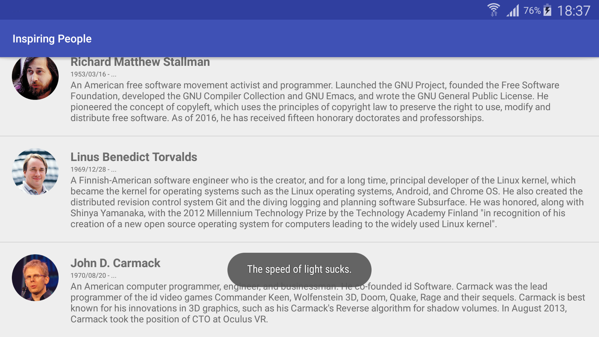
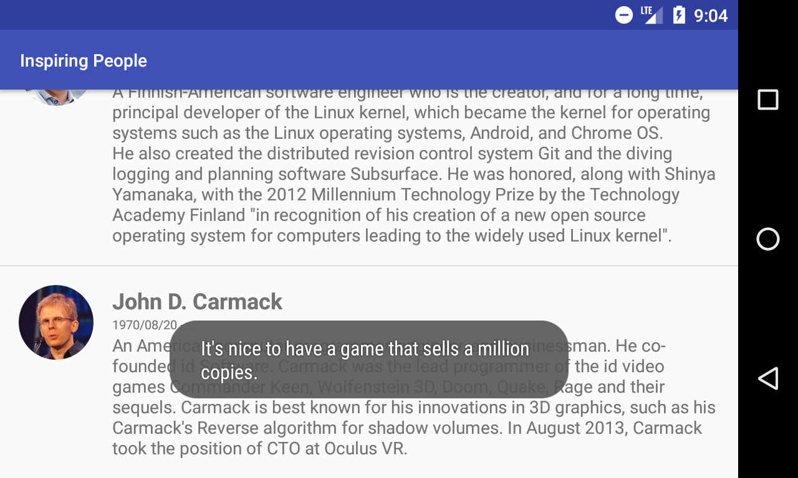

# Homework: Inspiring People

### The assignment and problems encountered

The task of this assignment was to develop a simple Android application which shows basic information about three inspiring or influential people in computer science. Tapping each person in the application should show a random quote said by the selected person.

To achieve this, information about these three persons were stored in a JSON file, which is later used to populate the interface using an implementation of the ArrayAdapter class.

### Utilised snippets/solutions/libraries/SO answers

* https://en.wikipedia.org/wiki/File:Richard_Matthew_Stallman.jpeg [a picture of Richard Stallman, taken from the cover of the O'Reilly book by Sam Williams]
* https://en.wikipedia.org/wiki/Richard_Stallman [basic information about Richard Stallman: full name, date of birth, short biography]
* https://en.wikiquote.org/wiki/Richard_Stallman [quotes by Stallman]
* https://en.wikipedia.org/wiki/File:Linus_Torvalds.jpeg [an image of Linus Torvalds, taken from an article in a December 2002 issue of Linux Magazine]
* https://en.wikipedia.org/wiki/Linus_Torvalds [basic information about Linus Torvalds]
* https://en.wikiquote.org/wiki/Linus_Torvalds [quotes by Torvalds]
* https://en.wikipedia.org/wiki/File:John_Carmack_GDC_2010.jpg [official GDC image of John Carmack]
* https://en.wikipedia.org/wiki/John_Carmack [basic information about John Carmack]
* https://en.wikiquote.org/wiki/John_D._Carmack [quotes by Carmack]
* https://appsandbiscuits.com/listview-tutorial-android-12-ccef4ead27cc [general guidance on populating a ListView]
* https://www.raywenderlich.com/124438/android-listview-tutorial [more ListView hints, JSON file parsing code]
* https://stackoverflow.com/questions/12781273/what-are-the-date-formats-available-in-simpledateformat-class
* https://stackoverflow.com/questions/21856260/how-can-i-convert-string-to-drawable
* https://stackoverflow.com/questions/244777/can-comments-be-used-in-json
* https://gist.github.com/uupaa/f77d2bcf4dc7a294d109 [scaling images in GFM]

### Screenshots

Samsung Galaxy Note 3 (SM-N900) running Lollipop (5.0)

  

Nexus 4 running Nougat (7.1.1) (virtual device)

  

### Bottom line
Java's parser did not bite me for that, but it turns out [comments are not defined in the JSON format](https://stackoverflow.com/questions/244777/can-comments-be-used-in-json). Found it out after committing [this](https://github.com/skomaromi/inspiring-people/commit/584971bb9cd0991415bb848a6a434d854ce47074). Ugh.
